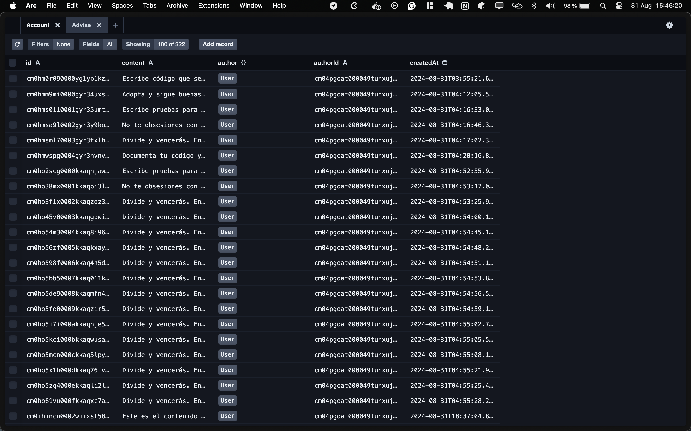

#  Website de programaConNosotros

Este es el repositorio del website de PCN. El website está construido con Next.js. Podés contribuir al proyecto a través de pull requests. Revisa la información a continuación para comenzar a programar con nosotros! 🚀

## 📖 Guía para contribuir

1. Instalar [Docker](https://docs.docker.com/get-docker/) y [Docker Compose](https://docs.docker.com/compose/install/) en tu computadora.
2. Clonar el repositorio.

3. Crear archivo de variables de entorno con el nombre `.env` utilizando `.env.template` como base. Si no tenés acceso a las variables de entorno, podés usar las variables de entorno de desarrollo que están en el archivo `.env.development`.

4. Levantar el servidor de desarrollo con Docker Compose. Utilizamos Docker para que no tengas que instalar Node.js ni ninguna otra dependencia en tu computadora. Para levantar el servidor, ejecutá el siguiente comando en la raíz del proyecto.

   ```bash
   docker-compose up
   ```

   > El código dentro del contenedor de Docker se sincronizará con el de tu computadora automáticamente, por lo cual no hace falta ejecutar ningún comando adicional para ver los cambios que hagas en tu código.

   > Si usas Visual Studio Code para desarrollar, hay una configuración para poder desarrollar usando los Dev Containers de Visual Studio Code, los cuales te permiten posicionar tu editor dentro del contenedor, y poder tener una experiencia de desarrollo similar a la que tendrías si estuvieras desarrollando el proyecto localmente en tu computadora sin utilizar Docker. Cuando abras el proyecto en Visual Studio Code, debería avisarte que podés desarrollar dentro del container, si aceptás, se configurará todo automáticamente para que puedas hacerlo.

5. Una vez dentro del container, tenes que ejecutar las migraciones de la base de datos con el siguiente comando:

   ```bash
   pnpm apply-migrations
   ```

   > Tenes que usar `pnpm` si o si en este proyecto. Si usas `npm` o `yarn`, vas a tener problemas. Por favor, asegurate de usar `pnpm` para todo lo relacionado a las dependencias del proyecto.

6. Crea una nueva rama en Git para ir guardando tus cambios (la página se va refrescando automáticamente en tu browser, no hace falta que refresques manualmente).

7. Pusheá tus cambios a GitHub y crea una pull request hacia la rama `testing`, asegurate de que tenga una buena descripción explicando lo que hiciste, con capturas de pantalla o videos si incluyen cambios de UI.

8. Si queres instalar dependencias de desarrollo, tenes que usar el siguiente comando:

   ```bash
   pnpm add NOMBRE_DEL_PAQUETE
   ```

> [!IMPORTANT]
> Todas las contribuciones deben ser realizadas a través de pull requests. No se aceptarán cambios directos en las ramas `main` y `testing`. Las pull requests serán revisadas y aprobadas por los administradores del repositorio, y deben solicitar merge a la rama `testing`, no `main`. Una vez aprobado el testing, se hará merge a `main`.

> [!NOTE]
> Cada vez que quieras crear un commit, automáticamente se formateará el código con Prettier y se verificará que la app compile y el linter no encuentra errores. Si hay errores, no se podrá hacer commit. Esto se hace para mantener la calidad del código, pedimos disculpas por las demoras que esto pueda ocasionar al ejecutar el comando para crear un commit.

> [!NOTE]
> Tenemos un channel en Discord para coordinar el desarrollo del website. Si no estás en el Discord, podes sumarte haciendo click [acá](https://discord.gg/tPZExRnbBP).

## Trabajo con la base de datos

- Para crear registros de prueba en la base de datos, tenes que ejecutar el siguiente comando:

  ```bash
  pnpm populate-database
  ```

- Si cambias algún modelo de base de datos, tenes que hacer una migración. Para eso, ejecutá el siguiente comando:

  ```bash
  pnpm create-migration NOMBRE_DE_LA_MIGRACION
  ```

- Si pulleaste los cambios de GitHub y hay nuevas migraciones, vas a tener que aplicarlas con el siguiente comando:

  ```bash
  pnpm apply-migrations
  ```

- Prisma ofrece un studio que permite visualizar la base de datos. Para acceder al studio, ejecutá el siguiente comando:

  ```bash
  pnpm prisma-studio
  ```

  Luego vas a poder acceder a la URL [http://localhost:5555](http://localhost:5555) en el navegador web y vas a poder ver la base de datos.

  

## 🛠️ Tech stack

- [Docker](https://www.docker.com/) (contenedores)
- [Node.js](https://nodejs.org/) (entorno de ejecución de JavaScript)
- [pnpm](https://pnpm.io/) (gestor de paquetes)
- [TypeSript](https://www.typescriptlang.org/) (lenguaje de programación)
- [React.js](https://reactjs.org/) (librería de JavaScript para construir interfaces de usuario)
- [Next.js](https://nextjs.org/) (framework de React.js)
- [Tailwind CSS](https://tailwindcss.com/) (estilos de la página)
- [ESLint](https://eslint.org/) (linting del código)
- [Husky](https://typicode.github.io/husky/#/) (pre-commit hooks)
- [Prettier](https://prettier.io/) (formateo del código)
- [shadcn/ui](https://ui.shadcn.com/) (componentes reusables de React.js con Tailwind CSS)
- [Git](https://git-scm.com/) (control de versiones del código)
- [GitHub](https://www.github.com/) (plataforma de desarrollo colaborativo)

## 📁 Estructura de archivos

La estructura de archivos del proyecto sigue las convenciones de Next.js:

```
.
├── src/                 # Directorio principal de la aplicación
│   ├── app/             # Páginas y rutas de la aplicación
│   ├── api/             # Rutas de API
│   ├── components/      # Componentes React reutilizables
│   ├── lib/             # Funciones y utilidades compartidas
│   └── [route]/         # Páginas y rutas de la aplicación
├── prisma/              # Configuración y migraciones de Prisma
├── public/              # Archivos estáticos accesibles públicamente
├── .env                 # Variables de entorno (no incluido en el repositorio)
├── .env.example         # Plantilla para variables de entorno
├── docker-compose.yml   # Configuración de Docker Compose
├── next.config.mjs       # Configuración de Next.js
├── package.json         # Dependencias y scripts del proyecto
└── tsconfig.json         # Configuración de TypeScript
```

## 📚 Aprender más

Para aprender más sobre Next.js, puedes revisar los siguientes recursos:

- [Documentación de Next.js](https://nextjs.org/docs) - aprender sobre las características y funcionalidades de Next.js.
- [Learn Next.js](https://nextjs.org/learn) - un tutorial interactivo de Next.js.
