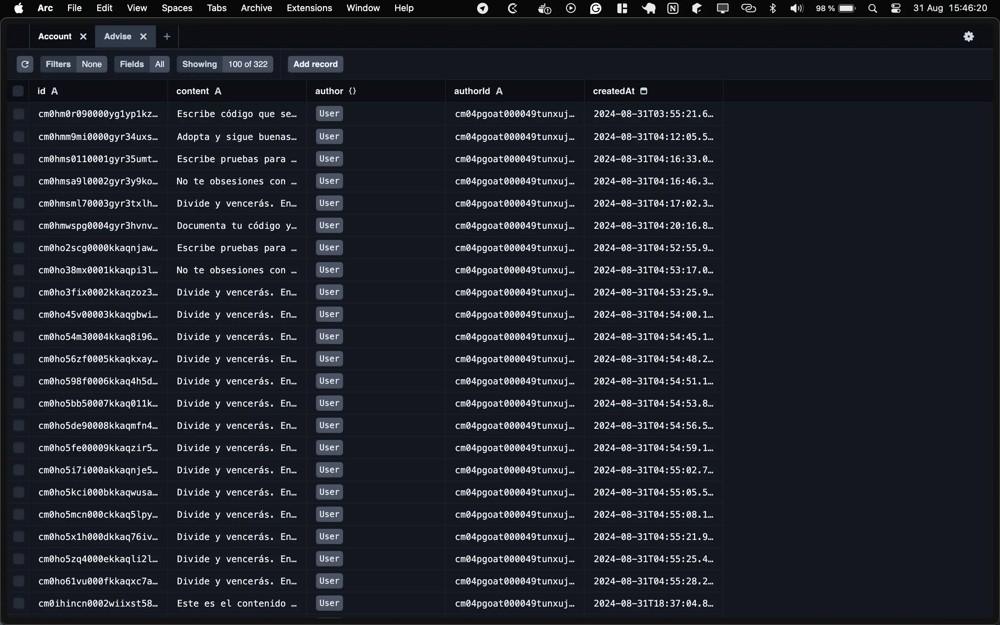

#  Website de programaConNosotros

Este es el repositorio del website de PCN. El website está construido con Next.js. Podés contribuir al proyecto a través de pull requests. Revisa la información a continuación para comenzar a programar con nosotros! 🚀

## 📖 Guía para contribuir

1. Instalar [Docker](https://docs.docker.com/get-docker/) y [Docker Compose](https://docs.docker.com/compose/install/) en tu computadora.

2. Clonar el repositorio.

3. Crear archivo de variables de entorno con el nombre `.env` utilizando `.env.template` como base. Si no tenés acceso a las variables de entorno, podés usar las variables de entorno de desarrollo que están en el archivo `.env.development`.

4. Levantar el servidor de desarrollo con Docker Compose. Utilizamos Docker para que no tengas que instalar Node.js ni ninguna otra dependencia en tu computadora. Para levantar el servidor, ejecutá el siguiente comando en la raíz del proyecto.

   ```bash
   docker-compose up -d
   ```

   > El código dentro del contenedor de Docker se sincronizará con el de tu computadora automáticamente, por lo cual no hace falta ejecutar ningún comando adicional para ver los cambios que hagas en tu código.

   > Si usas Visual Studio Code para desarrollar, hay una configuración para poder desarrollar usando los Dev Containers de Visual Studio Code, los cuales te permiten posicionar tu editor dentro del contenedor, y poder tener una experiencia de desarrollo similar a la que tendrías si estuvieras desarrollando el proyecto localmente en tu computadora sin utilizar Docker. Cuando abras el proyecto en Visual Studio Code, debería avisarte que podés desarrollar dentro del container, si aceptás, se configurará todo automáticamente para que puedas hacerlo.

5. Una vez levantados los contenedores de base de datos y web, tenés que ejecutar las migraciones:
   - Si posees MacOS o Linux simplemente ejecuta el siguiente comando:
   ```bash
   make apply-migrations
   ```
   - Si posees Windows y no podes usar el comando `make`, tendrías que ejecutar lo siguiente:
   ```bash
   docker exec -i pcn-web /bin/sh -c "pnpm apply-migrations"
   ```

> [!IMPORTANT]
> Tenes que usar `pnpm` si o si en este proyecto. Si usas `npm` o `yarn`, vas a tener problemas. Por favor, asegurate de usar `pnpm` para todo lo relacionado a las dependencias del proyecto.

7. Crea una nueva rama en Git para ir guardando tus cambios (la página se va refrescando automáticamente en tu browser, no hace falta que refresques manualmente).

8. Pusheá tus cambios a GitHub y crea una pull request hacia la rama `testing`, asegurate de que tenga una buena descripción explicando lo que hiciste, con capturas de pantalla o videos si incluyen cambios de UI.

   El nombre de la pull request debe tener el siguiente formato: `[ID del ticket de Notion] - Título del ticket en Notion`.

9. Si queres instalar dependencias de desarrollo, tenes que usar el siguiente comando:

   ```bash
   pnpm add NOMBRE_DEL_PAQUETE
   ```

> [!IMPORTANT]
> Todas las contribuciones deben ser realizadas a través de pull requests. No se aceptarán cambios directos en las ramas `main` y `testing`. Las pull requests serán revisadas y aprobadas por los administradores del repositorio, y deben solicitar merge a la rama `testing`, no `main`. Una vez aprobado el testing, se hará merge a `main`.

> [!NOTE]
> Cada vez que quieras crear un commit, automáticamente se formateará el código con Prettier y se verificará que la app compile y el linter no encuentra errores. Si hay errores, no se podrá hacer commit. Esto se hace para mantener la calidad del código, pedimos disculpas por las demoras que esto pueda ocasionar al ejecutar el comando para crear un commit.

> [!NOTE]
> Tenemos un channel en Discord para coordinar el desarrollo del website. Si no estás en el Discord, podes sumarte haciendo click [acá](https://discord.gg/tPZExRnbBP).

## Trabajo con la base de datos

- Para crear registros de prueba en la base de datos, tenes que ejecutar el siguiente comando:

  ```bash
  pnpm populate-database
  ```

  El script es idempotente: borra y recrea datos de prueba (conserva usuarios por email). Incluye usuarios, consejos, likes, eventos, sponsors, inscripciones, charlas y propuestas, anuncios, testimonios, ofertas de trabajo, comentarios, lenguajes de programación, notificaciones, visitas de página, y logs de errores/aplicación.

  También podés resetear la base y volver a poblarla con:

  ```bash
  pnpm reset-database
  ```

  (aplica migraciones y corre el seed automáticamente).

- Si cambias algún modelo de base de datos, tenes que hacer una migración. Para eso, ejecutá el siguiente comando:

  ```bash
  pnpm create-migration NOMBRE_DE_LA_MIGRACION
  ```

- Si pulleaste los cambios de GitHub y hay nuevas migraciones, vas a tener que aplicarlas con el siguiente comando:

  ```bash
  pnpm apply-migrations
  ```

- Prisma ofrece un studio que permite visualizar la base de datos. Para acceder al studio, ejecutá el siguiente comando:

  ```bash
  pnpm prisma-studio
  ```

  Luego vas a poder acceder a la URL [http://localhost:5555](http://localhost:5555) en el navegador web y vas a poder ver la base de datos.

  

## 🌿 Trabajo con worktrees (Claude Code)

Si usás `claude -w` para abrir sesiones de Claude Code, cada worktree recibe automáticamente su propia base de datos Postgres aislada.

### Cómo funciona

- Al iniciar una sesión (`claude -w`), el hook `SessionStart` ejecuta `scripts/setup-worktree-db.sh` automáticamente.  
  El script:

  1. Deriva el nombre de la base a partir del directorio del worktree (ej. `delightful-skipping-comet` → `pcn_delightful_skipping_comet`).
  2. Crea esa base dentro del contenedor `pcn-db` compartido.
  3. Genera el `.env` del worktree copiando el del checkout principal y apuntando `DATABASE_URL`/`DIRECT_URL` a la nueva base.
  4. Instala dependencias si no existen (`node_modules/`).
  5. Aplica migraciones y ejecuta el seed con datos de prueba.

- Al salir de la sesión y elegir **"remove worktree"**, el hook `WorktreeRemove` ejecuta `scripts/drop-worktree-db.sh` automáticamente y elimina la base de datos del worktree.

Todo esto requiere que el contenedor `pcn-db` esté corriendo:

```bash
pnpm docker:up:dettached
```

### Comandos manuales

Si necesitás provisionar o limpiar un worktree a mano:

```bash
# Crear la base, .env, migraciones y seed para el worktree actual
pnpm setup-worktree-db

# Eliminar la base del worktree actual (o de uno en particular)
pnpm drop-worktree-db
pnpm drop-worktree-db /ruta/al/worktree
```

### Servidor de desarrollo con múltiples worktrees

`pnpm dev` ya usa portless por defecto, por lo que cada worktree obtiene su propia URL `.localhost` automáticamente — sin conflictos de puerto:

```bash
pnpm dev
```

`portless run` detecta automáticamente si estás en un worktree y asigna una URL única por rama:

| Contexto                     | URL                                       |
| ---------------------------- | ----------------------------------------- |
| Checkout principal           | `https://pcn-website.localhost`           |
| Worktree en rama `testing`   | `https://testing.pcn-website.localhost`   |
| Worktree en rama `fix-login` | `https://fix-login.pcn-website.localhost` |

El puerto interno se asigna automáticamente — sin conflictos, sin configuración extra. La primera vez genera un certificado local y lo agrega al sistema de confianza (requiere `sudo` en macOS/Linux).

> [!NOTE]
> portless requiere **Node 24+** (LTS "Krypton"). Si usás `nvm`, ejecutá `nvm use` en la raíz del proyecto para activar la versión correcta (`.nvmrc` ya está configurado). Si desarrollás con Docker, el contenedor sigue usando `next dev` directamente en el puerto 3000 — no necesita portless.

> [!NOTE]
> El `.env` de cada worktree es generado automáticamente y **no se versiona** (está en `.gitignore`). Si el worktree no tiene `.env`, ejecutá `pnpm setup-worktree-db` o iniciá una nueva sesión de Claude Code.

## 📧 Emails en desarrollo local

El stack de Docker incluye [MailHog](https://github.com/mailhog/MailHog), un servidor SMTP local que captura todos los emails que envía la aplicación sin entregarlos realmente. Esto te permite probar flujos de email (registro, reseteo de contraseña, códigos de verificación) sin necesitar credenciales de Gmail.

MailHog se levanta automáticamente junto con los demás contenedores al ejecutar `docker-compose up`. Podés ver los emails capturados en:

[http://localhost:18025](http://localhost:18025)

> [!NOTE]
> El puerto del servidor web de MailHog es `18025` (y no el `8025` por defecto) para evitar conflictos si ya tenés una instancia de MailHog corriendo localmente. El puerto SMTP es `11025`.

## 🛠️ Tech stack

- [Docker](https://www.docker.com/) (contenedores)
- [Node.js](https://nodejs.org/) (entorno de ejecución de JavaScript)
- [pnpm](https://pnpm.io/) (gestor de paquetes)
- [TypeSript](https://www.typescriptlang.org/) (lenguaje de programación)
- [React.js](https://reactjs.org/) (librería de JavaScript para construir interfaces de usuario)
- [Next.js](https://nextjs.org/) (framework de React.js)
- [Tailwind CSS](https://tailwindcss.com/) (estilos de la página)
- [ESLint](https://eslint.org/) (linting del código)
- [Husky](https://typicode.github.io/husky/#/) (pre-commit hooks)
- [Prettier](https://prettier.io/) (formateo del código)
- [shadcn/ui](https://ui.shadcn.com/) (componentes reusables de React.js con Tailwind CSS)
- [Git](https://git-scm.com/) (control de versiones del código)
- [GitHub](https://www.github.com/) (plataforma de desarrollo colaborativo)

## 📁 Estructura de archivos

La estructura de archivos del proyecto sigue las convenciones de Next.js:

```
.
├── src/                 # Directorio principal de la aplicación
│   ├── app/             # Páginas de la aplicación
│   ├── actions/         # Server actions de Next.js
│   ├── api/             # Rutas de API
│   ├── components/      # Componentes React reutilizables
│   └── lib/             # Funciones y utilidades compartidas
├── prisma/              # Configuración y migraciones de Prisma
├── public/              # Archivos estáticos accesibles públicamente
├── .env                 # Variables de entorno (no incluido en el repositorio)
├── .env.example         # Plantilla para variables de entorno
├── docker-compose.yml   # Configuración de Docker Compose
├── next.config.mjs       # Configuración de Next.js
├── package.json         # Dependencias y scripts del proyecto
└── tsconfig.json         # Configuración de TypeScript
```

## 📚 Aprender más

Para aprender más sobre Next.js, puedes revisar los siguientes recursos:

- [Documentación de Next.js](https://nextjs.org/docs) - aprender sobre las características y funcionalidades de Next.js.
- [Learn Next.js](https://nextjs.org/learn) - un tutorial interactivo de Next.js.
